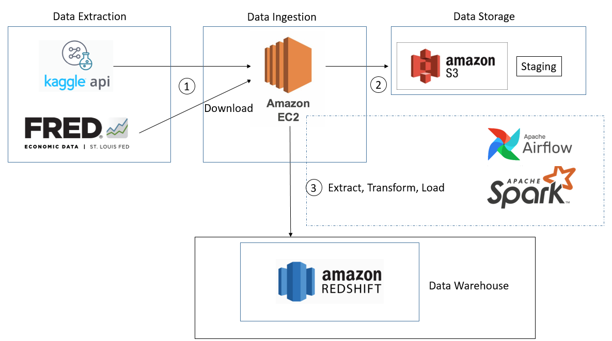
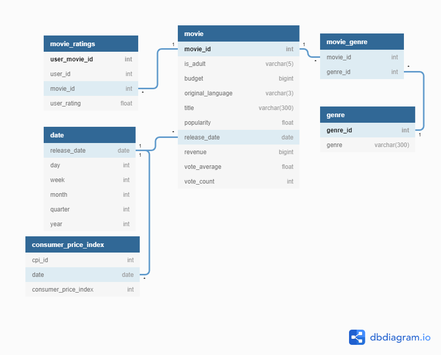
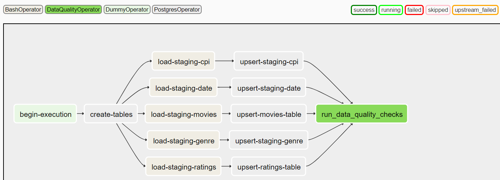

## Movalytics
---
  

## Project Description
---
* This project is a case study for a start-up, involved with recommending movies to users as a service, as well as investigating certain factors contributing to the success of movies.
* The aim of this project, is to perform Extract, Transform, Load, on movies data, to answer questions the business may have about its users, such as:
    * What is the highest rated movie of all time?
    * Which genre of movies are the most popular with users?
    * Trends in box office earnings - Does releasing a movie at a certain quarter/month of a year, lead to higher box office earnings?
    * Which genres are the highest earning of all-time, normalized against a consumer price index?

* The movies data and metadata comes from Movielens, extracted from a Kaggle dataset: https://www.kaggle.com/rounakbanik/the-movies-dataset. The data contains 26 million user ratings of over 270,000 users on a collection of over 45,000 movies.
* In addition, Consumer Price Index of Admission to Movies, Theaters, and Concerts in U.S. City Average is extracted from: https://fred.stlouisfed.org/series/CUSR0000SS62031. This will help us normalize box office earnings against inflation over the years.

## Architecture
---
The technical architecture for this project is as show below:  
  

1. Data Extraction is done using Kaggle API and using GET request to St Louis Fred's CPI dataset. 

2. Downloaded data files to EC2 are stored and staged in S3 bucket.

3. Airflow ETL pipeline is used to schedule and monitor the data flow. 

4. Data Processing is done using Spark. 

5. Data is ingested into Redshift.

## Choice of Technologies
---
* For data processing (data transformation step), Spark is chosen because of its parellel processing capabilities. Should the amount of data proliferate to 100x, more worker nodes can be added to the spark cluster to scale out.

* For orchestrating the steps in the pipeline, Airflow is chosen as it allows building of data pipelines that are straghtforward and modular. Airflow allows tasks to be defined in a Directed Acyclic Graph (DAG) with dependencies of tasks between one another. This allows running of tasks to be optimized. It also enables the pipeline to be run on a schedule (for eg, daily) should the need arise. Finally, it has an intuitive UI that allows users to check the steps in the data pipeline should any part of the pipeline fail.

* Redshift is chosen as the cloud Data Warehouse as it is highly scalable. Should our data grow in size, we can provision more nodes or scale up, to handle the larger volume of data.

* Docker is used to encapsulate package dependencies the code may have, to allow the code to run on any machine

## Data Model
---
* The data model for this project is as shown below:  
  
  
  
The approach taken, is to normalize the data. This will lead to more efficient UPDATES and DELETES as and when required.

## ETL Pipeline
---
The ETL process runs through an Airflow DAG:  
  
  
  
The process is as follows:
1. We create the tables and staging tables (if they do not exist)  
2. We perform an update and insert, based on new data coming in  
3. Run a data quality check (check that tables have more than 1 row and there are no null ids)
